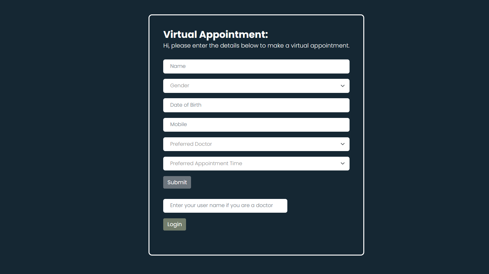

<h1 align="center">Welcome to 🩺 Virtual Appointment App 🏥</h1>
<p>
  
</p>

> Today many health clincis still rely on paper forms to gather patient details and arrange doctor appointments. This process is not only time-consuming but also prone to errors. This Virtual Appointment Application will help you transform this tedioius process into a seamless experience, enabling clinicians collect neccessary information and connect patients with preferred doctors with ease.

### ✨ [Demo deployed on Azure App Services](https://rl-patientapp.azurewebsites.net/) ✨

## How to set this up locally

Before running this website locally, first we need to set up the feature flag properly on the LaunchDarkly platform.

1. Create a project and environment on the platform and copy the SDK key. In _index.js_, look for const client = LaunchDarkly.init(_LAUNCHDARKLY_SDK_KEY_);, replace _LAUNCHDARKLY_SDK_KEY_ with the SDK key you just copied.

### First Feature Flag - A new version of the form with new data fields

2. One of the features I have set up is to add in a few field in the appointment request form to gather data around respiratory symptoms to provide the best care and protect other patients.
3. To make this feature available, first create a feature flag named **'newDataField'** on the platform
4. Once you turn on the targeting for this feature, you should see a green 'Beta' version of the form with a newly added field 'Respiratory Symptoms'
   

### Second Feature Flag - Next patient appointment look up for doctors (should be tested separately to the first feature flag)

5. Another feature I have implemented is giving doctors the ability to look up next patient appointment and call the patient.
6. This feature will involve individual targeting towards specified doctors
7. To make this feature available, create a feature flag named **'showDoctorView'** on the platform, under Individual targets, specify a test doctor name e.g. Dr.Lin and leave the default rollout as False
8. To test this feature, stick with the default home page (Navy blue version), enter 'Dr.Lin' as the doctor to log in.
9. Wait for the user context for Dr.Lin to be created in the portal, once you have created and signed in again, you should be able to see the next patient details and a call button.

## Install

Check you have installed both **dotenv** and **launchdarkly-node-server-sdk** locally on your machine.

```sh
npm install
```

## Usage

```sh
npm start
```

## Author

👩‍💻 **Regina Lin**
